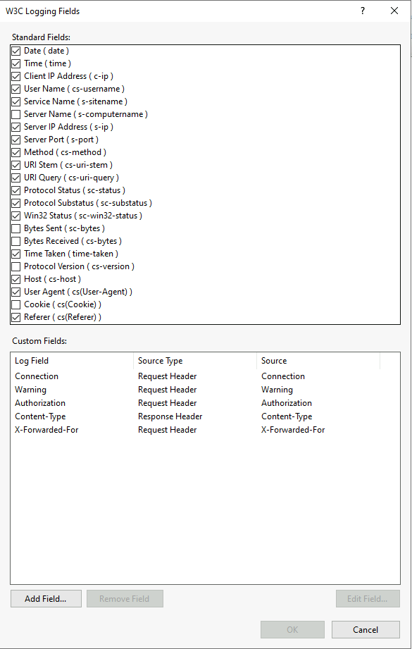

# Data collection rule from custom text logs for IIS to include X-Forwarded-For

- As of this writing, the native Azure Monitor IIS logs data source does not support collecting the X-Forwarded-For custom field.
- When users access your web application through proxies or load balancers, the IP field in IIS logs may record the IP address of the intermediary device rather than the actual client’s IP address.
- You can use X-Forwarded-For request header to find and log the IP address of the client.

## Cited Resources

- [How to use X-Forwarded-For header to log actual client IP address?](https://techcommunity.microsoft.com/blog/iis-support-blog/how-to-use-x-forwarded-for-header-to-log-actual-client-ip-address/873115)
- [Collect IIS logs from virtual machine with Azure Monitor](https://learn.microsoft.com/en-us/azure/azure-monitor/vm/data-collection-iis)
- [Data collection rule (DCR) samples in Azure Monitor](https://learn.microsoft.com/en-us/azure/azure-monitor/data-collection/data-collection-rule-samples#text-logs)

## Assumptions

- A Windows Server 2022 machine is available with the Web Server (IIS) role installed, and IIS logging is configured to include additional fields in compliance with the Microsoft Internet Information Services (IIS) 10.0 Security Technical Implementation Guide (STIG), Version 3, Release 2 (Benchmark Date: 24 Oct 2024).
- The necessary logging fields have been added, and all steps outlined in this guide assume these settings are in place.

- The IIS log has been reviewed and its fields aligned with the [W3CIISLog](https://docs.azure.cn/en-us/azure-monitor/reference/tables/w3ciislog) schema to design a custom table structure.
- A sample log was parsed using KQL to validate the schema and ensure compatibility.

```kql
//Test to parse results from IIS log file.
let RawLog = datatable(RawData:string)
[
"#Software: Microsoft Internet Information Services 10.0",
"#Version: 1.0",
"#Date: 2025-06-27 03:16:16",
"#Fields: date time s-sitename s-ip cs-method s-uri-stem cs-uri-query s-port cs-username c-ip cs(User-Agent) cs(Referer) cs-host sc-status sc-substatus sc-win32-status time-taken Connection Warning Authorization Content-Type X-Forwarded-For",
"2025-06-27 03:16:13 W3SVC2 ::1 GET /favicon.ico - 8080 - ::1 Mozilla/5.0+(Windows+NT+10.0;+Win64;+x64)+AppleWebKit/537.36+(KHTML,+like+Gecko)+Chrome/137.0.0.0+Safari/537.36+Edg/137.0.0.0 http://localhost:8080/ localhost:8080 404 0 2 1085 keep-alive - - - -"
];
RawLog 
| where not(RawData startswith "#") 
| extend fields = split(RawData, " ") 
| extend     
Date = tostring(fields[0]),    
Time = tostring(fields[1]),     
sSiteName = tostring(fields[2]),     
sIP = tostring(fields[3]),     
csMethod = tostring(fields[4]),     
csUriStem = tostring(fields[5]),     
csUriQuery = tostring(fields[6]),     
sPort = toint(fields[7]),     
csUsername = tostring(fields[8]),     
cIP = tostring(fields[9]),     
csUserAgent = tostring(fields[10]),     
csReferer = tostring(fields[11]),     
csHost = tostring(fields[12]),     
scStatus = tostring(fields[13]),     
scSubStatus = tostring(fields[14]),     
scWin32Status = tostring(fields[15]),     
timeTaken = toint(fields[16]),     
Connection = tostring(fields[17]),     
Warning = tostring(fields[18]),     
Authorization = tostring(fields[19]),     
ContentType = tostring(fields[20]),     
XForwardedFor = tostring(fields[21]),     
TimeGenerated = todatetime(strcat(fields[0], " ", fields[1]))
```


## Steps

### Create a custom table

We need to create a custom table to send the logs to and we will do this using an ARM template

- Sign in to the Azure Portal
- Search for or navigate to Deploy a custom tempate
- Click on Build your own template in the editor

- Copy the following JSON into the window to replace what exists

```json
  {
  "$schema": "https://schema.management.azure.com/schemas/2019-04-01/deploymentTemplate.json#",
  "contentVersion": "1.0.0.0",
  "resources": [
    {
      "type": "Microsoft.OperationalInsights/workspaces/tables",
      "apiVersion": "2022-10-01",
      "name": "[concat(parameters('workspaceName'), '/W3CIISLog_CL')]",
      "location": "[resourceGroup().location]",
      "properties": {
        "schema": {
          "name": "W3CIISLog_CL",
          "columns": [
            {
              "name": "TimeGenerated",
              "type": "datetime",
              "description": "Date and time the record was generated."
            },
            {
              "name": "Date",
              "type": "string",
              "description": "Date of the log entry."
            },
            {
              "name": "Time",
              "type": "string",
              "description": "Time of the log entry."
            },
            {
              "name": "sIP",
              "type": "string",
              "description": "IP address of the server that accepted the request."
            },
            {
              "name": "csMethod",
              "type": "string",
              "description": "HTTP method used by the client."
            },
            {
              "name": "csUriStem",
              "type": "string",
              "description": "Target of the action such as a web page."
            },
            {
              "name": "csUriQuery",
              "type": "string",
              "description": "Query string portion of the URI."
            },
            {
              "name": "sPort",
              "type": "int",
              "description": "Server port number that is configured for the service."
            },
            {
              "name": "csUserName",
              "type": "string",
              "description": "Name of the authenticated user that accessed the server."
            },
            {
              "name": "cIP",
              "type": "string",
              "description": "IP address of the client that accessed the web server."
            },
            {
              "name": "csUserAgent",
              "type": "string",
              "description": "Browser type of the client."
            },
            {
              "name": "csReferer",
              "type": "string",
              "description": "Site that the user last visited."
            },
            {
              "name": "csHost",
              "type": "string",
              "description": "Host header name if any."
            },
            {
              "name": "scStatus",
              "type": "string",
              "description": "HTTP status code."
            },
            {
              "name": "scSubStatus",
              "type": "string",
              "description": "Substatus error code."
            },
            {
              "name": "scWin32Status",
              "type": "string",
              "description": "Windows status code."
            },
            {
              "name": "TimeTaken",
              "type": "long",
              "description": "Time taken to process the request, in milliseconds."
            },
            {
              "name": "Connection",
              "type": "string",
              "description": "Connection header value."
            },
            {
              "name": "Warning",
              "type": "string",
              "description": "Warning header value."
            },
            {
              "name": "Authorization",
              "type": "string",
              "description": "Authorization header value."
            },
            {
              "name": "Computer",
              "type": "string",
              "description": "Name of the computer that the event was collected from."
            },
            {
              "name": "ContentType",
              "type": "string",
              "description": "Content-Type value."
            },
            {
              "name": "XForwardedFor",
              "type": "string",
              "description": "X-Forwarded-For header value indicating original client IP."
            }
          ]
        }
      }
    }
  ],
  "parameters": {
    "workspaceName": {
      "type": "string",
      "metadata": {
        "description": "Name of the Log Analytics workspace"
      }
    }
  }
}
```

- Click Save
- Fill in the following
- **Resource group:** select your Resource group
- **Workspace Name:** enter your Log Analytics Workspace name

- Click Review + create
- Click Create
- Once your deployment is complete natigate to your Log Analytics workspace you create the table in
- Click on the tables blade and filter by W3CIISLog_CL to review your new table


### Create a Data Collection Rule

We need to create a Data Collection Rule and we will do this using an ARM template

- Once again search for or navigate to Deploy a custom tempate
- Click on Build your own template in the editor

- Copy the following JSON into the window to replace what exists

```json
{
  "$schema": "https://schema.management.azure.com/schemas/2019-04-01/deploymentTemplate.json#",
  "contentVersion": "1.0.0.0",
  "parameters": {
    "dcrName": {
      "type": "string",
      "metadata": {
        "description": "Name of the Data Collection Rule"
      }
    },
    "workspaceResourceId": {
      "type": "string",
      "metadata": {
        "description": "Resource ID of the Log Analytics workspace"
      }
    },
    "filePatterns": {
      "type": "string",
      "metadata": {
        "description": "Enter the file path(s) for each IIS site you want to upload in comma separated format. Example: C:\\inetpub\\logs\\LogFiles\\W3SVC1\\*.log,C:\\inetpub\\logs\\LogFiles\\W3SVC2\\*.log"
      }
    },
    "transformKql": {
      "type": "string",
      "defaultValue": "source | where not(RawData startswith \"#\") | extend fields = split(RawData, \" \") | extend     Date = tostring(fields[0]),     Time = tostring(fields[1]),     sSiteName = tostring(fields[2]),     sIP = tostring(fields[3]),     csMethod = tostring(fields[4]),     csUriStem = tostring(fields[5]),     csUriQuery = tostring(fields[6]),     sPort = toint(fields[7]),     csUsername = tostring(fields[8]),     cIP = tostring(fields[9]),     csUserAgent = tostring(fields[10]),     csReferer = tostring(fields[11]),     csHost = tostring(fields[12]),     scStatus = tostring(fields[13]),     scSubStatus = tostring(fields[14]),     scWin32Status = tostring(fields[15]),     timeTaken = tostring(fields[16]),     Connection = tostring(fields[17]),     Warning = tostring(fields[18]),     Authorization = tostring(fields[19]),     ContentType = tostring(fields[20]),     XForwardedFor = tostring(fields[21]),     TimeGenerated = todatetime(strcat(fields[0], \" \", fields[1]))",
      "metadata": {
        "description": "Default entered is to process all fields from IIS log included in the IIS STIG plus X-Forwarded-For"
      }
    }
  },
  "variables": {},
  "resources": [
    {
      "type": "Microsoft.Insights/dataCollectionRules",
      "apiVersion": "2023-03-11",
      "name": "[parameters('dcrName')]",
      "location": "[resourceGroup().location]",
      "kind": "Windows",
      "properties": {
        "streamDeclarations": {
          "Custom-Text-W3CIISLog_CL": {
            "columns": [
              {
                "name": "TimeGenerated",
                "type": "datetime"
              },
              {
                "name": "RawData",
                "type": "string"
              },
              {
                "name": "FilePath",
                "type": "string"
              },
              {
                "name": "Computer",
                "type": "string"
              }
            ]
          }
        },
        "dataSources": {
          "logFiles": [
            {
              "streams": [
                "Custom-Text-W3CIISLog_CL"
              ],
              "filePatterns": "[split(parameters('filePatterns'), ',')]",
              "format": "text",
              "name": "Custom-Text-W3CIISLog_CL"
            }
          ]
        },
        "destinations": {
          "logAnalytics": [
            {
              "workspaceResourceId": "[parameters('workspaceResourceId')]",
              "name": "la-workspace"
            }
          ]
        },
        "dataFlows": [
          {
            "streams": [
              "Custom-Text-W3CIISLog_CL"
            ],
            "destinations": [
              "la-workspace"
            ],
            "transformKql": "[parameters('transformKql')]",
            "outputStream": "Custom-W3CIISLog_CL"
          }
        ]
      }
    }
  ]
}
```

- Click Save
- Fill in the following
- **Resource group:** select your Resource group
- **Dcr Name:** Name of the Data Collection Rule
- **Workspace Resource Id:** Resourse ID of Log Analytics Workspace
- **File Patterns:** Enter the file path(s) for each IIS site you want to upload in comma separated format. Example: C:\inetpub\logs\LogFiles\W3SVC1\*.log,C:\inetpub\logs\LogFiles\W3SVC2\*.log
- **Transform Kql:** Default entered is to process all fields from the IIS log

- Click Review + create
- Click Create
- Once your deployment is complete navigate to Azure Monitor
- Click on the Data Collection Rules blade and click on the new rule you just created
- Click on the Resources blade and Add the IIS server you have logging configured on that you want to collect data from

- Once you see *Successfully checked the existence of AMA on the resource* you can wait 5-10 minutes and test going to the Website to generate new logs

## Post Condition

- Query the new table

- Analyze the data and create analytic rules needed for custom detections.
