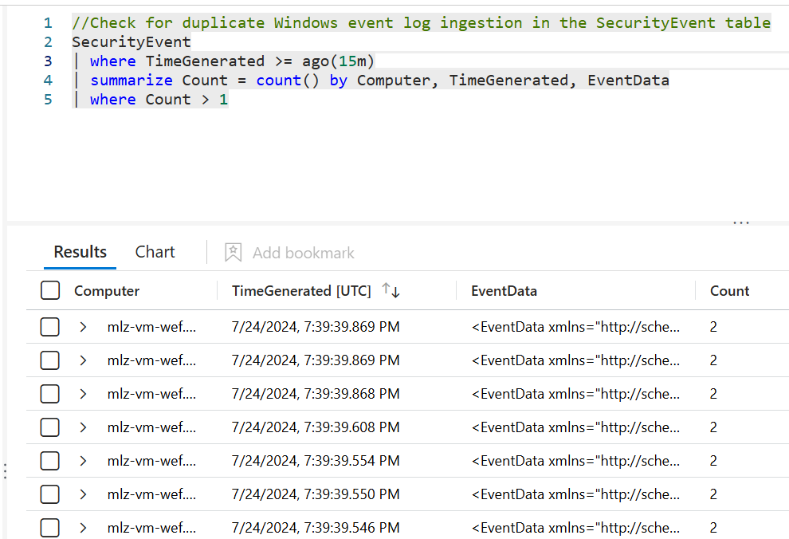
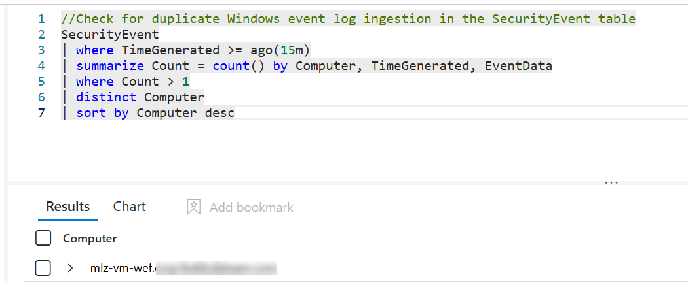
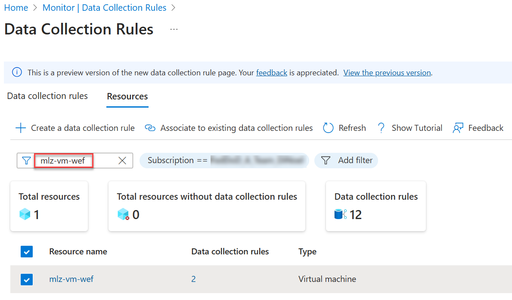
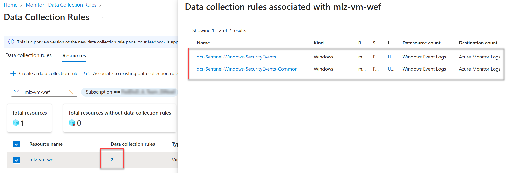
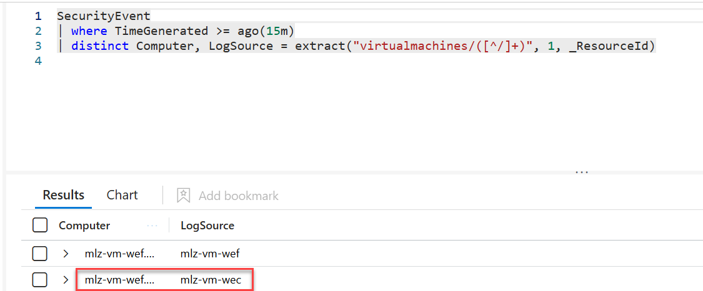

# Check for duplicate Windows event log ingestion

This walkthrough helps identify duplicate Windows event log ingestion in the SecurityEvent table

## Cited Resources:
[SecurityEvent](https://learn.microsoft.com/en-us/azure/azure-monitor/reference/tables/securityevent)
[Windows Event Collector](https://learn.microsoft.com/en-us/windows/win32/wec/windows-event-collector)

## Assumptions:
You already know the unique data mapped to an attribute that you can search for and identify duplicate data.
We will be checking against the SecurityEvent table using Computer, TimeGenerated, and EventData attributes to help make each event unique.

## Steps:

We will be using KQL to return results below

### Getting started reviewing the logs in Microsoft Sentinel

- Go to the [Azure Portal] (https://portal.azure.com/)
- Click on my Microsoft Sentinel workspace
- Click on the Logs blade
- paste in the following KQL

```kusto
//Check for duplicate Windows event log ingestion in the SecurityEvent table
SecurityEvent
| where TimeGenerated >= ago(15m)
| summarize Count = count() by Computer, TimeGenerated, EventData
| where Count > 1
```

KQL results:



If results return from the query like it did mine I am going to continue narrowing down my results

### Identify how many computers are impacted

Adding a few more lines to find how many computers may have duplicate logs ingested.


```kusto
//Check for duplicate Windows event log ingestion in the SecurityEvent table
SecurityEvent
| where TimeGenerated >= ago(15m)
| summarize Count = count() by Computer, TimeGenerated, EventData
| where Count > 1
| distinct Computer
| sort by Computer desc
```

KQL results:



## Finding what is causing the duplicate logs
Depending on how you are ingesting logs duplicate log ingestion could happen in several ways.  I am going to cover two examples

### Example One - Computer in multiple Data Collection Rules

You can check this by navigating to Azure Monitor
- Click on the Data Collection Rules
- Click on the blue banner labeled _We are previewing a new Browse experience. Click to switch._
- Click on the resources tab
- Search for the computer that came from your result above



Click on the # in the Data Collection rules column to review the Data Collection rules the computer is a part of. <br/>
Review results and take appropriate actions.



### Example two - Windows Event Forwarding is also being used
If example one only returned one Data Collection Rule for the computer logs are being ingested in an additional method such as Windows Event Forwarding <br/>
The _ResourceId attribute helps us determine where the log source is from. <br/>
Let's add _ResourceId and format it to cleanup the long string and only list the computer:

```kusto
SecurityEvent
| where TimeGenerated >= ago(15m)
| distinct Computer, LogSource = extract("virtualmachines/([^/]+)", 1, _ResourceId)
```


See how the Computer and LogSource are different?  mlz-vm-wec is a Windows Event Collector receiving logs from mlz-vm-wef.  
mlz-vm-wef is also ingesting logs from a data collection rule it is a resource of. <br/>

## Post Condition:

Once the initial cleanup has occured I would recommend creating a Sentinel Analytics Rule so an incident will be created and appropriate people can take action.
