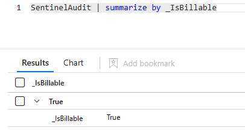
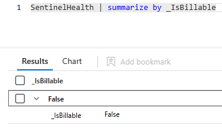
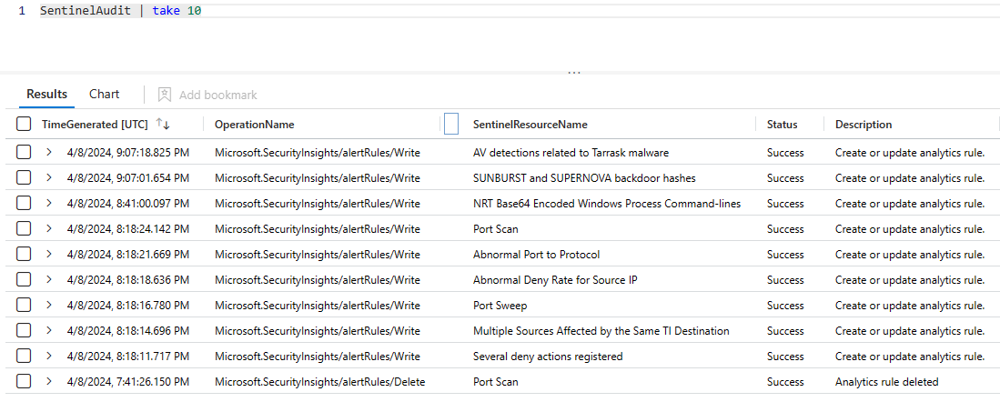
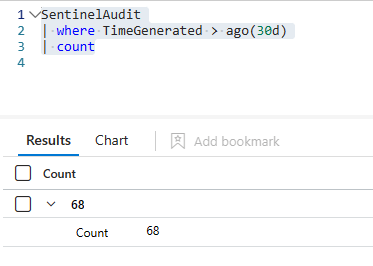
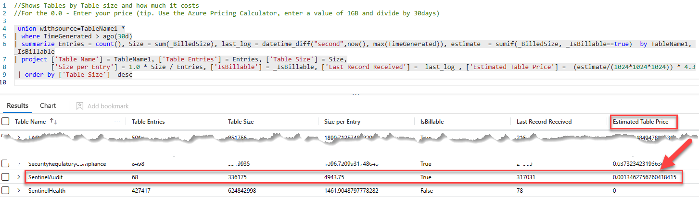
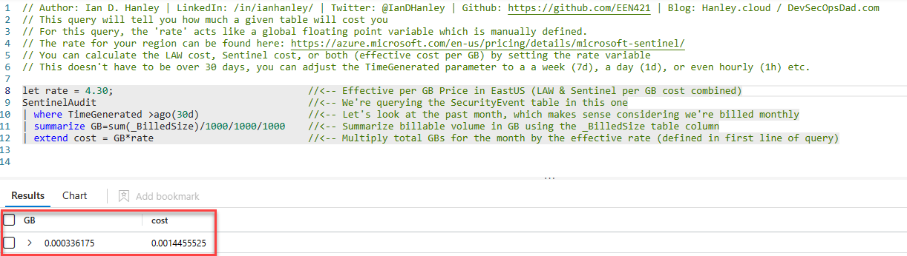

# Estimating cost of auditing and health monitoring for Microsoft Sentinel

This walkthrough helps estimate the cost of enabling the auditing and health monitoring feature for Microsoft Sentinel.

## Cited Resources:
[Turn on auditing and health monitoring for Microsoft Sentinel](https://learn.microsoft.com/en-us/azure/sentinel/enable-monitoring)
[_IsBillable](https://learn.microsoft.com/en-US/azure/azure-monitor/logs/log-standard-columns#_isbillable)
[Microsoft Sentinel pricing](https://azure.microsoft.com/en-us/pricing/details/microsoft-sentinel/)
[Rod-Trent:TableUsageandCost](https://github.com/rod-trent/SentinelKQL/blob/master/TableUsageandCost.txt)
[Ian Hanley:Cost of a Table.kql](https://github.com/EEN421/KQL-Queries/blob/Main/Cost%20of%20a%20Table.kql)

## Assumptions:

- This feature creates and uses the SentinelHealth and SentinelAudit tables.
- The _IsBillable column specifies whether ingested data is considered billable. Data with _IsBillable equal to false does not incur data ingestion, retention or archive charges.
- I made changes to several analytic rules in Sentinel to help calculate cost.
- My Sentinel instance is in East US region and I am using the Pay-As-You-Go commitment tier.  The effective per GB price at the time of this article is $4.30 per GB.  This will be used later in our estimate.
## Steps:

We will be using KQL to return results below

### Checking the SentinelAudit table we see it is a billable table

```kusto
SentinelAudit | summarize by _IsBillable
```

KQL results:



### Checking the SentinelHealth table we return it is not a billable table

```kusto
SentinelHealth | summarize by _IsBillable
```

KQL results:



### Now we can focus on the SentinelAudit table because it is the only table that is billable for this feature.
Let's make sure we see data in the SentinelAudit table

```kusto
SentinelAudit | take 10
```

KQL results:



Reviewing to see that I made 68 changes in Sentinel in the last 30 days

```kusto
SentinelAudit
| where TimeGenerated > ago(30d)
| count
```

KQL results:



### Listing all tables to include isBillable and estimating table price based on current price commitment tier.  We will use the $4.30 per GB in this step.

```kusto
//Shows Tables by Table size and how much it costs
//For the 0.0 - Enter your price (tip. Use the Azure Pricing Calculator, enter a value of 1GB and divide by 30days)

 union withsource=TableName1 *
| where TimeGenerated > ago(30d)
| summarize Entries = count(), Size = sum(_BilledSize), last_log = datetime_diff("second",now(), max(TimeGenerated)), estimate  = sumif(_BilledSize, _IsBillable==true)  by TableName1, _IsBillable
| project ['Table Name'] = TableName1, ['Table Entries'] = Entries, ['Table Size'] = Size,
          ['Size per Entry'] = 1.0 * Size / Entries, ['IsBillable'] = _IsBillable, ['Last Record Received'] =  last_log , ['Estimated Table Price'] =  (estimate/(1024*1024*1024)) * 4.3
 | order by ['Table Size']  desc
```

KQL results:


### Different look at the data and converting B to GB

```kusto
// Author: Ian D. Hanley | LinkedIn: /in/ianhanley/ | Twitter: @IanDHanley | Github: https://github.com/EEN421 | Blog: Hanley.cloud / DevSecOpsDad.com
// This query will tell you how much a given table will cost you
// For this query, the 'rate' acts like a global floating point variable which is manually defined.
// The rate for your region can be found here: https://azure.microsoft.com/en-us/pricing/details/microsoft-sentinel/
// You can calculate the LAW cost, Sentinel cost, or both (effective cost per GB) by setting the rate variable
// This doesn't have to be over 30 days, you can adjust the TimeGenerated parameter to a a week (7d), a day (1d), or even hourly (1h) etc.

let rate = 4.30;                                  //<-- Effective per GB Price in EastUS (LAW & Sentinel per GB cost combined)
SentinelAudit                                     //<-- We're querying the SecurityEvent table in this one
| where TimeGenerated >ago(30d)                   //<-- Let's look at the past month, which makes sense considering we're billed monthly
| summarize GB=sum(_BilledSize)/1000/1000/1000    //<-- Summarize billable volume in GB using the _BilledSize table column
| extend cost = GB*rate                           //<-- Multiply total GBs for the month by the effective rate (defined in first line of query)
```

KQL results:


## Post Condition:

This can be used for any table to assist in estimating cost of over a period of time.  
Several workbooks in Microsoft Sentinel are also available to estimate cost and include additional factors like Microsoft Sentinel benefit for Microsoft 365 E5, A5, F5 and G5 customers.

