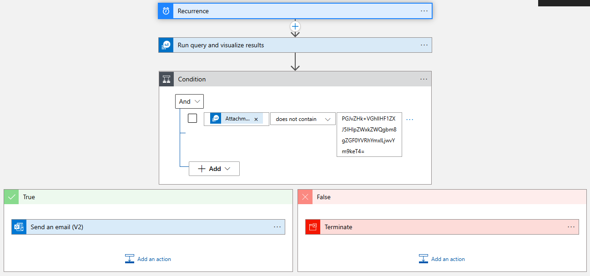

# Use a Logic App to send an e-mail with Log Analytics Workspace query results

This walkthrough is to show you how to create a Logic App to send an e-mail if a query against a Log Analytics Workspace returns results.

## Cited Resources:
[Add conditions to control workflow actions in Azure Logic Apps](https://learn.microsoft.com/en-us/azure/logic-apps/logic-apps-control-flow-conditional-statement?tabs=consumption) <br/>
[Create a Consumption logic app workflow](https://learn.microsoft.com/en-us/azure/logic-apps/tutorial-build-schedule-recurring-logic-app-workflow#create-a-consumption-logic-app-workflow) <br/>

## Assumptions:

- A Log Analytics Workspace exists and contains tables and data
- basic knowledge on how to create a Logic App

## Steps:

### Create Logic App

- Sign in to the Azure Portal and click on Create a Resource
-  Search for or navigate to Logic App and click on create <br/>
  
- On the Basics tab enter the information for Subscription, Resource Group, Logic App Name, and Region.
- Plan Type: Consumption <br/>
   
- Review + create
- Click Create

### Configuring Logic App

#### Recurrence
-- Open the Logic App created in last step and click on the Logic app Designer blade on the left side.
- Click on Recurrence <br/>
  
- I want to get an e-mail if query results are returned once a day so I am selecting Interval: 1 Frequency: Day
#### Run query and visualize results
- Click on New step
- Search for "Run query and visualize results"
- Select Run query and visualize results from the Actions tab
- Enter a name for the connection, select an authentication type, tenant ID and Sign in <br/>
  
- Populate information where your Log Analytics Workspace is located
- Query: Enter the KQL query you want to use

Example Query
```kql
SigninLogs
| where TimeGenerated >ago(1d)
| summarize Attempts = count(), Failed=countif(ResultType !=0), Succeeded = countif(ResultType ==0) by AppDisplayName
| top 10 by Failed
| sort by Failed
```
> [!NOTE] Once you’ve confirmed everything is functioning correctly, I suggest switching all connections made with your user account to either a system-assigned or user-assigned managed identity.  <br/>
> Using managed identities allows you to assign Role-Based Access Control (RBAC) roles, whether built-in or custom, offering more precise access control to specific functions within the designated Azure resources.


- Time Range: The example query I used has TimeGenerated so I cam going to select _Set in query_
- Chart Type: Html Table <br/>
  

#### Condition
- Click on New step
- Search for "Control" and click on it]
- Click on Condition
- In the condition area click in the first field _Choose a value_ and click on Attachment Content <br/>
  
- In the second field select _does not contain_
- In the last field enter PGJvZHk+VGhlIHF1ZXJ5IHlpZWxkZWQgbm8gZGF0YVRhYmxlLjwvYm9keT4= 

> [!NOTE]
> Wondering where PGJvZHk+VGhlIHF1ZXJ5IHlpZWxkZWQgbm8gZGF0YVRhYmxlLjwvYm9keT4= came from?
> If the query does not return any results it indludes that string in the output and if you convert it from Base64 to ASCII it is <body>The query yielded no dataTable.</body>.

PowerShell to decode the string.
```powershell
# Replace 'PGJvZHk+VGhlIHF1ZXJ5IHlpZWxkZWQgbm8gZGF0YVRhYmxlLjwvYm9keT4=' with your actual Base64 string
$base64String = 'PGJvZHk+VGhlIHF1ZXJ5IHlpZWxkZWQgbm8gZGF0YVRhYmxlLjwvYm9keT4='

# Decode the Base64 string to ASCII
$asciiString = [System.Text.Encoding]::ASCII.GetString([System.Convert]::FromBase64String($base64String))

# Print the result
Write-Host "Decoded ASCII string: $asciiString"
```

#### True
- Under True click Add an action
- Search for _Send an email (V2)_
- Click on Send an email (V2) Office 365 Outlook
- Sign in with an account that has a mailbox you want to send the email from
- In the Body field Select Attachment Content
- Subject: Enter a Subject
- To: Enter an email you want to send the query results to <br/>
  
#### False
- Under False click Add an action
- Search for _Control_
- Click on Terminate
- Status: select Cancelled



## Post Condition:
When a query is ran and results are returned the condition will be true and the user will receive an e-mail <br/>


When a query is ran and **no** results are returned the condition will be false and the action will be terminiated with a cancelled status

If you receive an email that doe not have any results and has "The query yielded no dataTable go back and check you entered everything in the condition correctly

