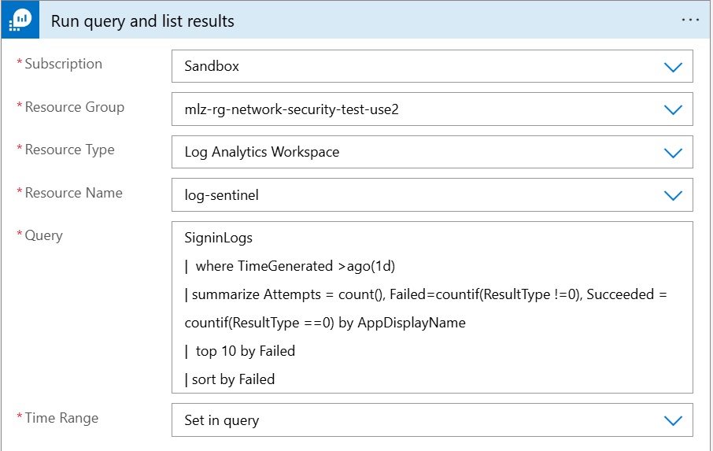
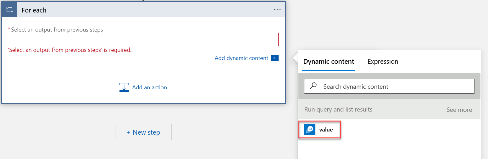

# Use a Logic App to send Log Analytics Workspace query results to a Log Analytics Workspace table

This walkthrough is to show you how to create a Logic App to send Log Analytics Workspace query results to a Log Analytics Workspace table

## Cited Resources:
[Create loops to repeat actions in workflows with Azure Logic Apps](https://learn.microsoft.com/en-us/azure/logic-apps/logic-apps-control-flow-loops?tabs=consumption#for-each) <br/>
[Create a Consumption logic app workflow](https://learn.microsoft.com/en-us/azure/logic-apps/tutorial-build-schedule-recurring-logic-app-workflow#create-a-consumption-logic-app-workflow) <br/>

## Assumptions:

- A Log Analytics Workspace exists and contains tables and data
- basic knowledge on how to create a Logic App

## Steps:

### Create Logic App

- Sign in to the Azure Portal and click on Create a Resource
-  Search for or navigate to Logic App and click on create <br/>
  
- On the Basics tab enter the information for Subscription, Resource Group, Logic App Name, and Region.
- Plan Type: Consumption <br/>
   
- Review + create
- Click Create

### Configuring Logic App

#### Recurrence
-- Open the Logic App created in last step and click on the Logic app Designer blade on the left side.
- Click on Recurrence <br/>
  
- I want to get an e-mail if query results are returned once a day so I am selecting Interval: 1 Frequency: Day
#### Run query and list results
- Click on New step
- Search for "Run query and list results"
- Select Run query and list results from the Actions tab
- Enter a name for the connection, select an authentication type, tenant ID and Sign in <br/>
  
- Populate information where your Log Analytics Workspace is located
- Query: Enter the KQL query you want to use

Example Query
```kql
SigninLogs
| where TimeGenerated >ago(1d)
| summarize Attempts = count(), Failed=countif(ResultType !=0), Succeeded = countif(ResultType ==0) by AppDisplayName
| top 10 by Failed
| sort by Failed
```
  
- Time Range: The example query I used has TimeGenerated so I cam going to select _Set in query_
  
#### For each
- Click on New step
- Search for "Control" and click on it]
- Click on For each
- In the condition area click in the field _Select an output from previous steps_ and click on value <br/>
  
- Click on _Add an action_
- Search for "Azure Log Analytics Data Collector" (Send Data) and click on it.
- Fill out the fields to connect to the Log Analytics workspace and click create
- Format the JSON Request body field the way you want the data to be entered in the table
- In the _Custom Log Name_ enter the new table name that you want the data sent to


## Post Condition:
Open the Log Analytics Workspace and query the new table for results <br/>


