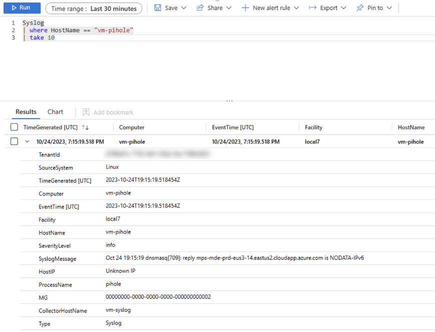

# Forward Pi-hole logs to Microsoft Sentinel

I wanted to send Pi-hole logs to Sentinel but could not install the Azure Monitor Agent on Raspberry Pi OS. </br>
Pi-hole also does not natively support sending logs to syslog so I choose to install rsyslog and [Forward Syslog data to a Log Analytics workspace with Microsoft Sentinel by using Azure Monitor Agent](https://learn.microsoft.com/en-us/azure/sentinel/forward-syslog-monitor-agent).

## Cited Resources:
[RSYSLOG - imfile: Text File Input Module](https://www.rsyslog.com/doc/v8-stable/configuration/modules/imfile.html?highlight=imfile)
[Pi-hole documentation](https://docs.pi-hole.net/)

## Assumptions:
- You already have a Raspberry Pi that meets Pi-hole hardware requirements.  </br>
- Raspberry Pi OS is installed and fully updated with the following commands:
```console
sudo apt update
sudo apt full-upgrade
```
- Pi-hole is installed - [One-Step Automated Install](https://docs.pi-hole.net/main/basic-install/)
- [onboarded Microsoft Sentinel](https://learn.microsoft.com/en-us/azure/sentinel/quickstart-onboard)

## Steps:

### Pi-hole Configuration

ssh or connect console of the Raspberry Pi 

Installed RSYSLOG:

```console
apt install rsyslog
```

Used the text editor to create a rsyslog configuration file:
```console
sudo nano /etc/rsyslog.d/90-pihole.conf
```

Added the below configuration to the file.

```console
#90-pihole.conf https://www.rsyslog.com/doc/v8-stable/configuration/modules/imfile.html?highlight=imfile
module(load="imfile" PollingInterval="10") #needs to be done just once

#Use global(workDirectory="/some/path") to set the working directory
global(workDirectory="/var/spool/rsyslog")

# pihole
input(type="imfile"
File="/var/log/pihole/pihole.log"
Tag="pihole"
reopenOnTruncate="on"
PersistStateInterval="10"
Severity="info"
Facility="local7")

#https://www.rsyslog.com/sending-messages-to-a-remote-syslog-server/
#this is the simplest forwarding action:
local7.info action(type="omfwd" target="192.168.2.9" port="514" protocol="tcp")
```

Walking through a few of the things entered in the conf file to help you understand the logic.
- We load the imfile module so we can later use it to read the pihole.log  </br>
- Using the global variable we set a working directory for the persistent state file to be located.
- Tag - tag the messages with pihole
- reopenOnTruncate - I added this after parameter after I discovered that around midnight I stopped receiving logs.  This parameter is a feature that tells rsyslog to reopen input file when it was truncated.  </br>
- target - is where you want to enter the IP address of your remote syslog server
- port - port the remote syslog server is listening on
- protocol - select tcp or udp protocol to send the remote syslog server

Full detail for everything I entered in the conf file can be found in at [RSYSLOG - imfile: Text File Input Module](https://www.rsyslog.com/doc/v8-stable/configuration/modules/imfile.html?highlight=imfile) 

Finished editing the file and saved and closed

### Check the config file for errors

```console
rsyslogd -f  /etc/rsyslog.d/90-pihole.conf -N1
```
This will identify any issues you need to resolve before the conf file will work.

My results returned that rsyslog does not have access to the pihole.log file

I received the following error:
imfile: error accessing file '/var/log/pihole/pihole.log' : Permission denied [v8.2001.0]

To fix this problem I am going to add the user syslog to the group pihole to keep the permissions persistent across reboots

```console
sudo usermod -a -G pihole syslog
```

Restarted the syslog daemon for the new configuration file to take affect:

```console
sudo systemctl restart rsyslog
```

Checked status of rsyslog:

```console
sudo systemctl status rsyslog
```
### Configure forwarding the logs into a Log Analytics workspace

Follow the steps in the Microsoft article on a support Linux server hosted in Azure or on-premises.  Steps will also include actions taken in Azure to configure a data collection rule for the syslog data:
[Forward Syslog data to a Log Analytics workspace with Microsoft Sentinel by using Azure Monitor Agent](https://learn.microsoft.com/en-us/azure/sentinel/forward-syslog-monitor-agent)

## Post Condition:

### Reviewing the logs in Microsoft Sentinel

- Go to the [Azure Portal] (https://portal.azure.com/)
- Clicked on my Microsoft Sentinel workspace
- Clicked on the Logs blade
- Selected the time range you want to review and type the following with the name of your Pi-hole in the HostName

```kusto
Syslog
| where HostName == "vm-pihole"
| take 10
```

Looking at the output you can see the parameters we entered in the rsyslog configuration file on the Pi-hole.
You can also see the full SyslogMessage </br>



### Parsing the Syslog messages

We have the data in the Syslog table in a Log Analytics workspace now what do I do with this ugly SyslogMessage string?

```kusto
Syslog
| where ProcessName == "pihole"
| extend message = split(SyslogMessage, " ")
| extend Time = strcat(message[0]," ", message[2]," ", message[3])
| project Time, Domain = message[6], Type = message[5], Status = message[8], message
```
