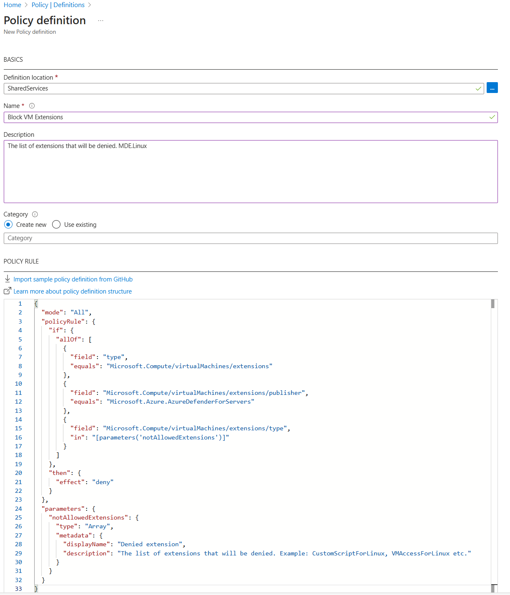
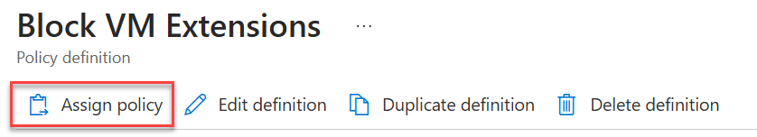
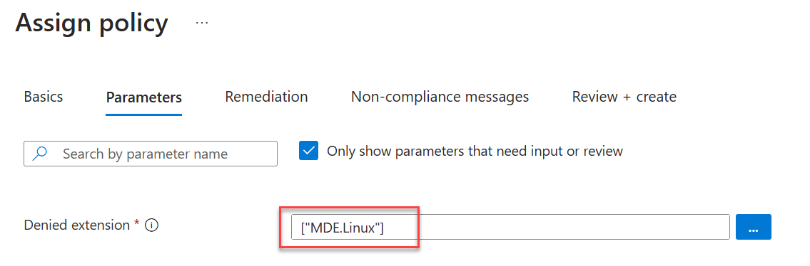

# Use Azure Policy to restrict the MDE extension installation on Linux VMs

- In this customer scenario, we will demonstrate how to prevent Linux servers from being onboarded to Endpoint Protection when Defender for Servers Plan 2 is enabled for a subscription.
- As of the time of writing, Defender for Servers Plan 2 can only be enabled at the subscription level.
- This can be useful if you prefer to onboard Linux servers to endpoint protection at a later time, allowing for a staged deployment.

> [!NOTE]
> This will only restrict new deployments of the MDE.Linux extension and will not remove any existing extensions

## Cited Resources

- [Use Azure Policy to restrict extensions installation on Linux VMs](https://learn.microsoft.com/en-us/azure/virtual-machines/extensions/extensions-rmpolicy-howto-cli)
- [Plan Defender for Servers deployment](https://learn.microsoft.com/en-us/azure/defender-for-cloud/plan-defender-for-servers)

## Assumptions

- Basic knowledge of Azure Policy
- You have the permissions to create and assign a new policy

## Steps

### Create a new Policy definition

- Sign in to the Azure Portal
- Search for or navigate to Azure Policy
- Click on the Definitions blade and select Policy definition and enter for following information
- **Definition location:** select the subscription you want this policy to apply to
- **Name:** Block VM Extensions
- **Description:** The list of extensions that will be denied. MDE.Linux
- POLICY RULE

```json
  {
  "mode": "All",
  "policyRule": {
    "if": {
      "allOf": [
        {
          "field": "type",
          "equals": "Microsoft.Compute/virtualMachines/extensions"
        },
        {
          "field": "Microsoft.Compute/virtualMachines/extensions/publisher",
          "equals": "Microsoft.Azure.AzureDefenderForServers"
        },
        {
          "field": "Microsoft.Compute/virtualMachines/extensions/type",
          "in": "[parameters('notAllowedExtensions')]"
        }
      ]
    },
    "then": {
      "effect": "deny"
    }
  },
  "parameters": {
    "notAllowedExtensions": {
      "type": "Array",
      "metadata": {
        "displayName": "Denied extension",
        "description": "The list of extensions that will be denied. Example: CustomScriptForLinux, VMAccessForLinux etc."
      }
    }
  }
}
```

- Click Save<br/>
  

### Assign policy

- Once the last section saved click on Assign policy  

- Click Next and go to Parameters section and enter the following
- **Denied extension:** ["MDE.Linux"]  

- Click Review + save

## Post Condition

- Test everything worked
- Continue your deployment of Defender for Servers
- When you are ready to onboard Linux servers you can remove this policy assignment
