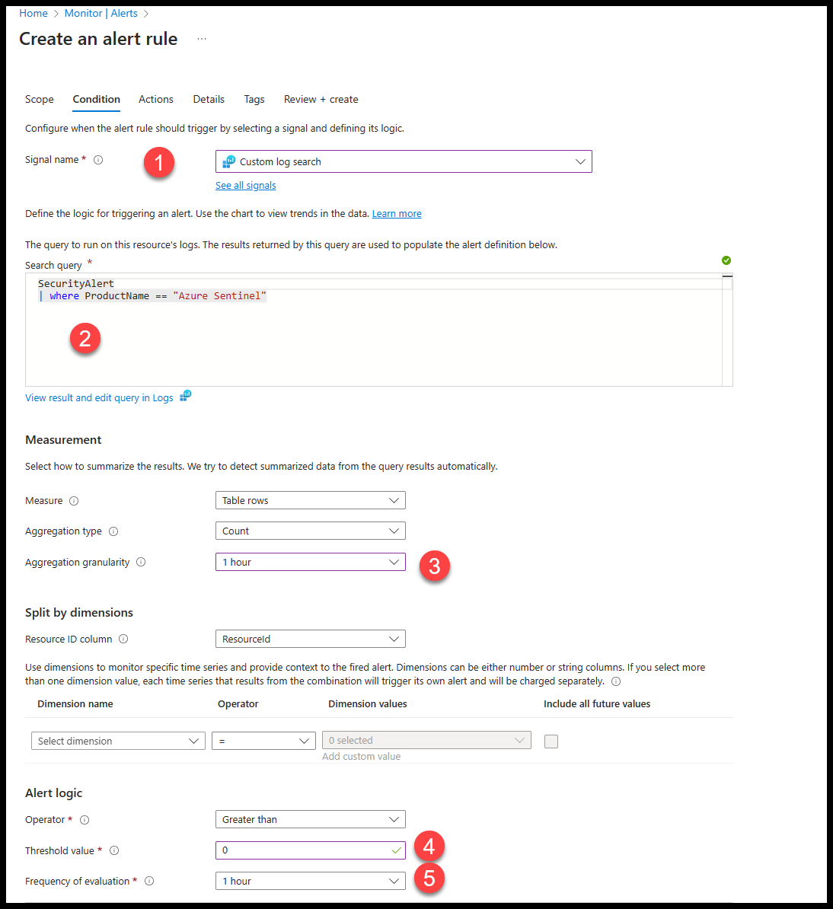
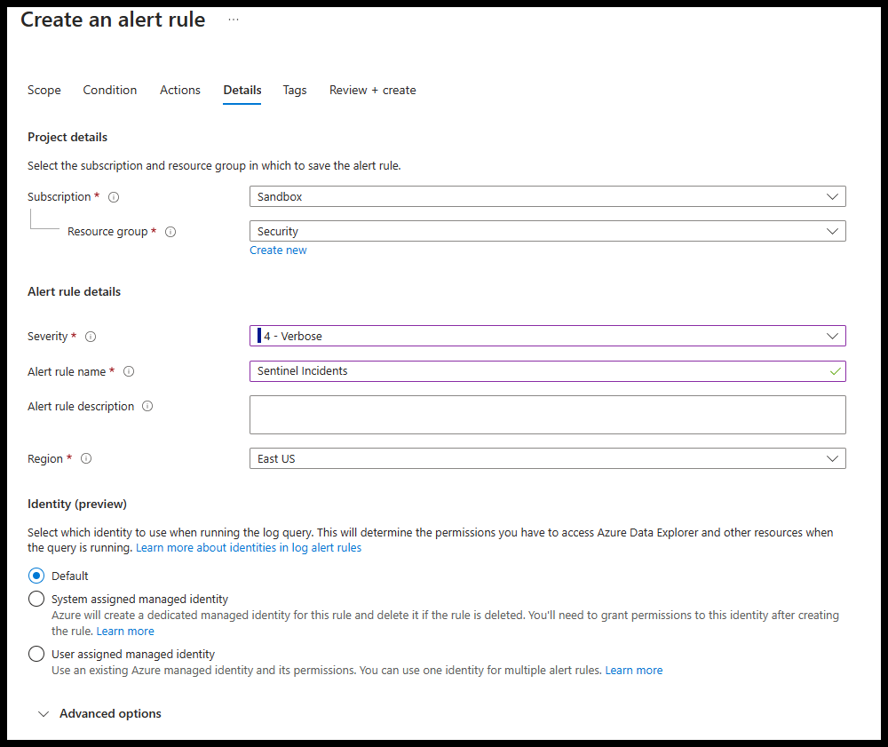
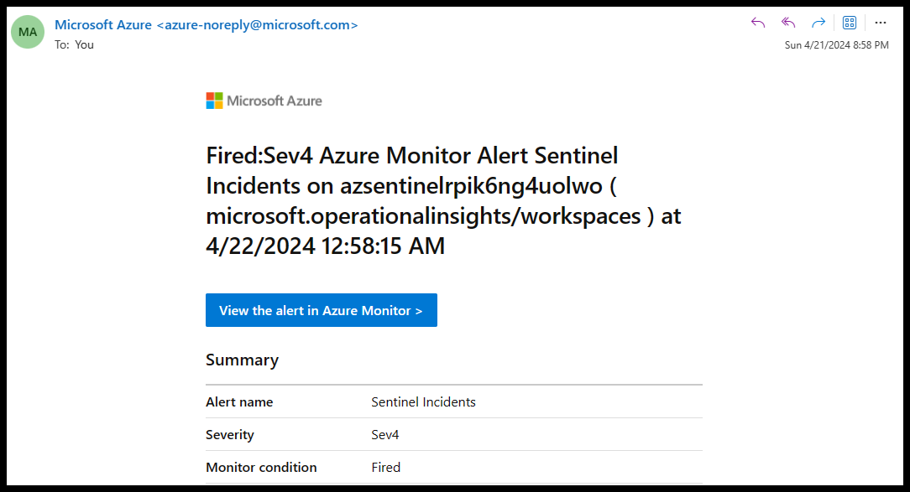

# Sending e-mail without having a mailbox in same tenant as Sentinel

In this example we will be using Azure Montitor to send alert e-mails to someone when new incidents arrive in Sentinel. This is an option if you are not licenced for any mailboxes in your tenant.

## New Alert rule
Go to Azure Monitor and click on the Alerts blade </br>
Click Create and select Alert rule

### Scope tab

click +Select scope and select the log analytics workspace that Sentinel is using

### Condition tab

1. For Signal Name select Custom log search in the drop down menu
2. Enter the following KQL

```kusto
SecurityAlert
| where ProductName == "Azure Sentinel"
```
Click Run button and click on Continue Editing Alert button

3. Measurement - select the Aggregation granularity which is the interval over which datapoints are grouped by the aggregation.
4. Alert logic- Select the Threshold value for how many incidents you want before triggering actions
5. Alert logic- Select the Frequency of evaluation for how often you want the alert to run



### Actions tab

Click +Create an action group

### Basics tab 
Fill out the required fields and click Next

### Notifications tab

For Notification type select Email/SMS message/Push/Voice from the drop down menu  </br>
Populate the Name field  </br>
On the fly out menu enter the Email you want this alert to be sent to and click on the OK button  </br>


That is all required and click the Review + Create
Click on Create button to finish creating the action group

This will take you back to Create an alert rule

Click Next to continue to the Details tab

### Details tab

For this example we are querying all Sentinel Incidents so we are going to select the following options-

### Alert rule details
Severity: 4 - Verbose
Alert rule name: Sentinel Incidents




Click Review + create button

After reviewing click the Create button


## Validate

Check the e-mail you used for the following items.  Depending on your spam filter the e-mails may be in Other of Junk.


Kick off an incident and confirm you got an e-mail




## Limit what Incidents you want to receive e-mails for

Change the KQL search query in your alert rules-

What to only send e-mail for high incidents in Sentinel?

```kusto
SecurityAlert
| where ProductName == "Azure Sentinel"
| where AlertSeverity == "High"
```

Only care about incidents generated by NRT analytic rules?

```kusto
SecurityAlert
| where ProductName == "Azure Sentinel"
| where ProviderName == "ASI NRT Alerts"
```

Or incidents that are from specific tactics?

```kusto
SecurityAlert
| where ProductName == "Azure Sentinel"
| where ProviderName == "ASI NRT Alerts"
| where Tactics == "DefenseEvasion"
```
